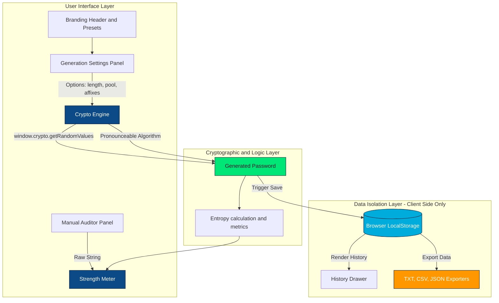

# Kawerify Tech Password Generator & Auditor

A premium, highly secure, client-side password generation utility and cryptographic education platform. Developed and managed by **Kawerify Tech** as a free public utility tool for individuals and teams worldwide.

- **Developer**: Developed by [Kawerify Tech](https://kawerifytech.com).
- **License**: Strictly **free of charge and non-commercial**. Under no circumstances is anyone permitted to distribute or use this software for financial gain. See the [LICENSE](file:///c:/Users/Tonde/Downloads/kawerify-tech-password-generator/docs/LICENSE.md) file.
- **Privacy & Security**: Zero tracking, zero ads, and zero server uploads. All passwords are created and stored within your browser sandbox.

---

## 🏗️ Architecture & Data Flow

This application is designed as a zero-trust, static client-side single page application (SPA). The diagram below illustrates how user options are calculated in real-time and how generated data is kept completely isolated inside the user's browser environment:



---

## 🚀 Key Features

### 1. Cryptographically Secure Generation
Instead of standard pseudorandom methods (like `Math.random()`), the engine leverages the browser's hardware-backed Web Cryptography API (`window.crypto.getRandomValues`) to ensure generated passwords are mathematically unpredictable.

### 2. Custom Exclusions & Readability Filters
- **Easy to Read**: Omit similar and confusing characters (such as `l, 1, I, o, 0, O, 2, Z, 5, S`).
- **Easy to Speak**: Generates pronounceable syllables alternating consonants and vowels (e.g., `tebofa-dinulo`) rather than complex character codes. Excellent for memorable secrets.
- **Exclude Ambiguous**: Excludes brackets, braces, quotes, slashes, and separators (`{ } [ ] ( ) / \ ' " ` ~ , ; : . < >`).
- **Custom Characters Filter**: Input custom character strings to avoid specific letters or symbols.
- **Custom Affixes**: Configure static prefixes or suffixes to prepend or append to passwords.

### 3. Real-Time Entropy Auditing
Calculates password entropy in bits using the standard logarithmic pool formula:
$$\text{Entropy} = \text{Length} \times \log_2(\text{Pool Size})$$

Tiers:
- **Weak** (< 40 bits): Vulnerable to simple online attacks.
- **Medium** (40–60 bits): Adequate for minor logins.
- **Strong** (60–85 bits): Highly secure against brute forcing.
- **Excellent** (>= 85 bits): Unbreakable under ordinary circumstances.

The **Auditor** panel also allows users to audit their own custom passwords in real-time, estimating crack time for both throttled online systems and heavy offline GPU brute-force configurations.

### 4. Saved Passwords Vault
- Save passwords to a local list with custom labels.
- Secure, masked view: Toggles visibility using eye icons so over-the-shoulder monitoring is prevented.
- Dynamic list filters: Search history by label, password content, or generation parameters.

### 5. Multi-Format Exporters
Export password vaults directly to your local file system as:
- **TXT Document**: A neatly aligned, human-readable text document.
- **CSV Spreadsheet**: Comma-separated spreadsheet format ideal for importing into other tools.
- **JSON Backup**: Raw structured data backup.

---

## 🛠️ Folder Structure

```
├── docs/                 # Legal & Security policies
│   ├── LICENSE.md        # Commercial use restrictions & attribution terms
│   ├── PRIVACY.md        # LocalStorage data isolation disclosures
│   ├── TERMS.md          # Terms of Service & warranties limits
│   ├── DISCLAIMER.md     # Liability disclaimers & math metrics warnings
│   ├── SECURITY.md       # Vulnerability disclosures & caching controls
│   ├── CONTRIBUTING.md   # Open source project guidelines
│   └── SUPPORT.md        # Support guidelines
├── src/
│   ├── components/       # UI Cards (Header, Footer, Generator, History)
│   ├── utils/            # Core logic (crypto generator, file exporter, storage)
│   ├── App.tsx           # Application shell & state wiring
│   ├── theme.ts          # Custom Material UI (MUI) glassmorphic dark theme
│   ├── types.ts          # TypeScript type contracts
│   └── index.css         # Animated blur blobs & styling variables
└── vercel.json           # Vercel static routing settings
```

---

## ⚙️ Development & Build

### Running Locally
1. Install dependencies:
   ```bash
   npm install
   ```
2. Launch Vite local server:
   ```bash
   npm run dev
   ```

### Building for Production
Vite compiles and minifies all assets into the `/dist` directory:
```bash
npm run build
```
This output directory is entirely static, containing no server-side scripts, and can be hosted immediately on Vercel, Netlify, or GitHub Pages.

---

## ⚖️ Legal & Security Documentation

We have established dedicated policies to protect users and the developers:
- [Custom Public License](file:///c:/Users/Tonde/Downloads/kawerify-tech-password-generator/docs/LICENSE.md) — Attributions, non-commercial restrictions, and free usage terms.
- [Privacy Policy](file:///c:/Users/Tonde/Downloads/kawerify-tech-password-generator/docs/PRIVACY.md) — Zero server collection, browser sandbox constraints.
- [Terms of Service](file:///c:/Users/Tonde/Downloads/kawerify-tech-password-generator/docs/TERMS.md) — Prohibited uses, system limitations.
- [Liability Disclaimer](file:///c:/Users/Tonde/Downloads/kawerify-tech-password-generator/docs/DISCLAIMER.md) — As-is warranties, cryptographic boundaries.
- [Security Policy](file:///c:/Users/Tonde/Downloads/kawerify-tech-password-generator/docs/SECURITY.md) — Vulnerability reporting protocols.
